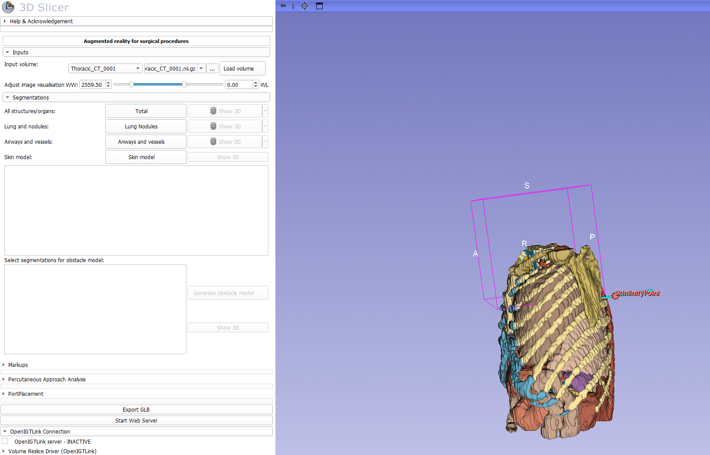

<!--  Scommentare quando renderò la repo pubblica--> 

# Bringing Augmented Reality Surgical Guidance to Meta Quest 3
This repository contains an augmented reality workflow for CT-guided lung biopsy planning and guidance using Meta Quest 3 and 3D Slicer.

The system allows a thoracic model generated from CT segmentation to be visualized in mixed reality, automatically registered to the patient using an automatic registration method via QR code, and used for biopsy trajectory planning. It also includes a cylindrical-marker needle tracking pipeline that estimates the pose of the instrument allowing the evaluation of the deviation between the actual trajectory and the virtually selected one.

## Repository Structure

- **LungNoduleBiopsyPlanner - 3D Slicer**
3D Slicer module for loading CT volumes, running segmentation, planning trajectories, exporting anatomical models as GLB, and communicating with Unity through OpenIGTLink.

- **Unity Project MQ3**
Unity project for the Meta Quest 3 application. It handles mixed-reality visualization, QR-based registration, model interaction, slice visualization, trajectory tools, and needle tracking feedback.
- **Pose Estimation in Python**
Python/Flask server for cylindrical-marker pose estimation. It receives camera frames from the Quest, runs the marker detection pipeline, and returns pose data to Unity.

## Main Workflow

1. Load a thoracic CT volume (NIfTI) in 3D Slicer
2. Segment relevant anatomy using TotalSegmentator
3. Plan the biopsy trajectory using Percutaneous Approach Analysis and related Slicer modules
4. Export the selected anatomy and trajectory and start the local GLB web server from the Slicer module
5. Launch the Unity application on Meta Quest 3
6. Register the virtual anatomy to the physical setup using the QR-code layout
7. Use the Quest GUI to interact with the model
8. If you want, set also the trajectory manually, through a laser system
9. Start needle tracking through the Python pose estimation server and visualize trajectory deviation

## Requirements

### 3D Slicer

- 3D Slicer 5.10.0
- Required Slicer extensions/modules:
  - [SlicerIGT](https://github.com/SlicerIGT/SlicerIGT)
  - [SlicerOpenIGTLink](https://github.com/openigtlink/OpenIGTLink)
  - [TotalSegmentator](https://github.com/wasserth/TotalSegmentator)
  - [Percutaneous Approach Analysis](LungNoduleBiopsyPlanner%20-%203DSlicer/PercutaneousApproachAnalysis.py)
  - [PortPlacement](https://www.slicer.org/wiki/Documentation/Nightly/Modules/PortPlacement) 
  - Volume Reslice Driver
- Python packages used by the Slicer module:
  - `numpy`
  - `trimesh`
  - `TotalSegmentator`
  - `open3d`

### Unity / Meta Quest 3

- Unity 6000.2.12f1
- [Meta XR All-in-One SDK](https://developers.meta.com/horizon/downloads/package/meta-xr-sdk-all-in-one-upm/)
- [glTFast](https://github.com/atteneder/glTFast)
- Meta Quest 3 connected to the development PC through USB-C
- ADB installed and available from terminal

### Python Pose Estimation Server

Python dependencies are listed in Pose Estimation in Python/requirements.txt

## Local Communication
The project is currently configured to use the Meta Quest 3 connected to the PC through USB-C, so when you run the application use asb reverse so that requests made by the Quest to localhost are forwarded to the PC. 

Ports used by the system:
| **Port** | **Purpose** |
| --- | --- |
| 5000 | Python Flask pose estimation server |
| 8080 | HTTP server used to import automatically the model in the Unity app, once exported |
| 18944 | OpenIGTLink communication between Unity and 3D Slicer |

## QR-Code Registration
The mixed-reality registration uses four QR codes with fixed payloads:
- Alto Sinistra
- Alto Destra
- Basso Sinistra
- Basso Destra

The printable QR-code sheet is aviable in docs/assets/qr/registration_qr_codes.pdf

## Aknowledgments
This project builds on and adapts code and ideas from:
- [HoloLens2and3DSlicer-PedicleScrewPlacementPlanning](https://github.com/BSEL-UC3M/HoloLens2and3DSlicer-PedicleScrewPlacementPlanning)
- [dvrk_calib_hand_eye](https://github.com/Cartucho/dvrk_calib_hand_eye/tree/main)